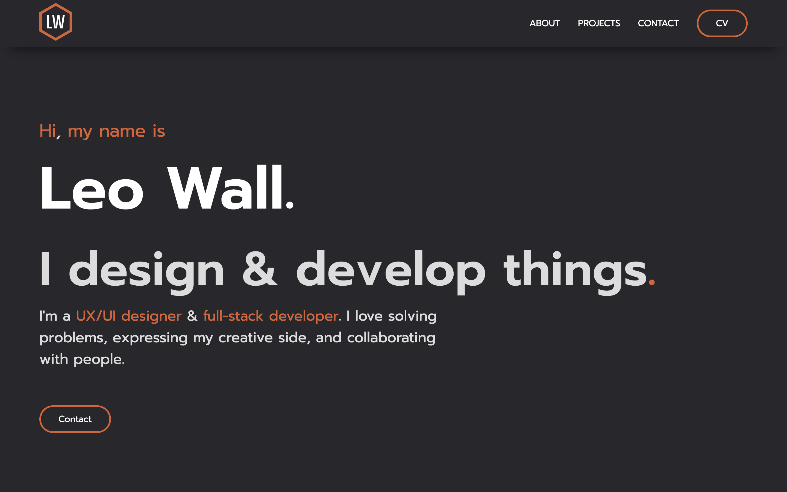
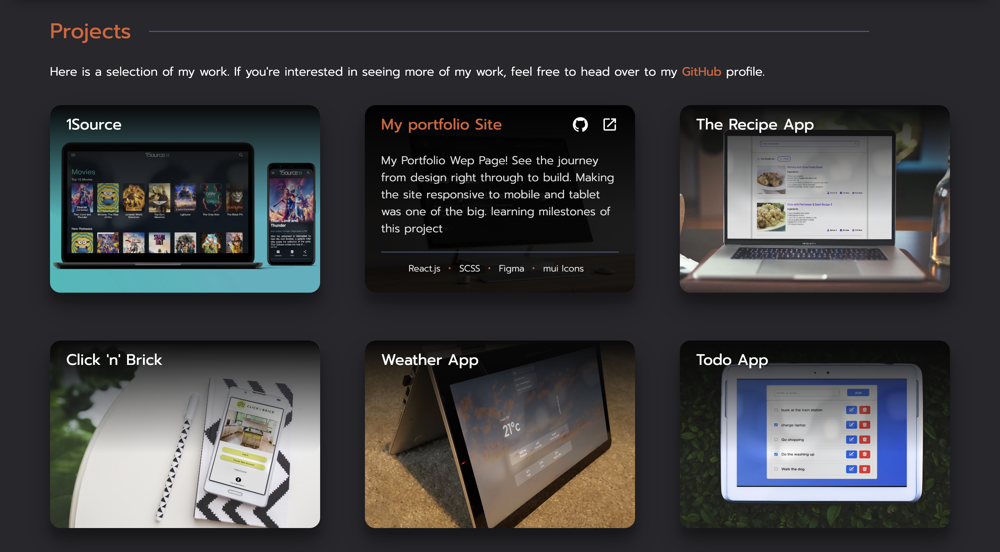

# My Portfolio

Welcome to my portfolio site. As with all portfolios, it's a place to anyone to get to know me better, view the projects I've been working, and get in contact with me.

Read on and get to grips with how the portfolio was designed and built.

## SITE FEATURES

- 4 main sdections: Introduction, About, Projects & Contact.
- Sticky navbar with scroll links to sections.
- Reusable button component: CV & contact via email.
- Project image cards have overlay that displays project sumamry, technologies used and links to github and deployed site.
- Responsive site: mobile, tablet & desktop.
    
    

## DESIGN PROCESS 
- Plan
    - Miro
        - step-1 set up a miro board to use as a collaborative platform for planing. 
   - user stories/ personas
        - To ensure to meet the needs of the user, firstly clarified who our target audience is. With the primary purpose being employemnt, recruiters, hiring managers and developers/designers would be our main audience. therefore, the design & development decisions were tailored to meet their (your) needs.
   - competitor analysis
        - With the target audience clear. and reviewed a number of portfolios. This was beneficial for a number of reasons, including: design, layout & content inspiration as well as an insight into potentially good practices. All of which helped to inspire our very own portfolio.
    - Component/ function tree
        - Next, it was good idea to use the previously gained inspiration to agree on what sections, functionality & componenta that would include. 
        
## UI DESIGN
- Design
    - Lo-fi Prototype
        - We developed a lo-fi prototype using miro to get an idea of how our single-page portfolio will be laidout. all of the previously agreed sections, functions and components were now put into their respective layout.
    Hi-fi prototype
        - Once the lo-fi prototype was agreed, we developed a hi-fi protoyype using figma. Drawing on inspiration from our competitor analysis, we decided on our colour pallette & typography and designed a working prototype on figma which we were both happy to move into development. (LINK)
    
​[Click here to view our Hi-Fi Figma prototype!](https://www.figma.com/proto/5QBBMysWUA67nxP3YgARbg/Untitled?node-id=21%3A297&scaling=scale-down&page-id=0%3A1&starting-point-node-id=21%3A297&show-proto-sidebar=1)  
    

## SKILLS USED AND LEARNED

- Making a responsive website: use of relative and absolute sizing, media queries, flexbox.
- File Structure for components/sections.
- Designing a professional looking website with design tools: Miro & Figma.
- getting to grips with CSS to meet spec of hi-fi prototype.
- Building a full, 1-page, scrollable website.
- Deployment: learning how to deploy on Netlify on an independent project.

## TECH STACK
- React.js
- SCSS
- Figma
- Miro
- MUI Icons
- Netlify

## FUTURE DEVELOPMENTS

- burger menu for the nav bar when in mobile view
- re-write/design of the about section to make it visually appealing and concise